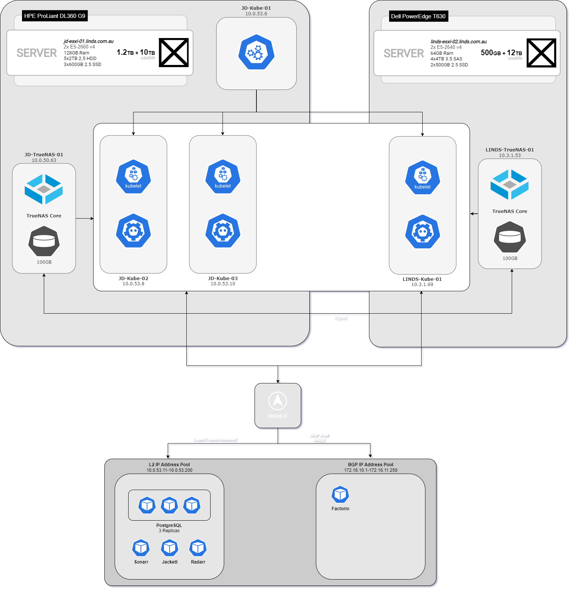

# [LINDS-Kubernetes](https://jayden-lind.github.io/posts/linds-kubernetes/)

Check out my blog post on **[Moving to Kubernetes](https://jayden-lind.github.io/posts/linds-kubernetes/)**

Hosts ever growing number of services. 

1. Sonarr
2. Radarr
3. Jackett
4. Tautulli
5. Factorio
6. PostgreSQL

Kubernetes is setup through [LINDS-Puppet](https://github.com/Jayden-Lind/LINDS-Puppet).

## Infrastructure



### Nodes

Consists of:

- 1x Master node (CentOS 9)
- 3x Worker nodes (CentOS 9)

2 worker nodes are in one physical location, and the last worker node in another.

### Storage

- 2x TrueNAS hosts (100GB NFS Storage)

The TrueNAS machines rsync to each other the differences for the PVC(Physical Volume Claims) for redundancy.

### Networking

Uses [MetalLB](https://metallb.universe.tf/) to expose these services through 2 different modes.

L2 (Layer 2) Advertisements, which just uses ARP for IPv4.

BGP Advertisements, which advertises to the 2 OPNSense box the route to the service.

## Usage:
``` sh

$ git clone git@github.com:Jayden-Lind/LINDS-Kube.git

$ chmod +x app-deployment.sh; ./app-deployment.sh

```

## Secrets
2 Secrets are required for operation.

1. NGINX-Ingress certificate
2. SMB/CIFS credentials for mounting SMB shares in a pod.

**NOTE**

Ensure to `base64` these secret values before applying them.

```yaml
---
apiVersion: v1
kind: Secret
metadata:
  name: linds-certificate-secret
  namespace: default
type: kubernetes.io/tls
data:
  tls.crt: xxx
  tls.key: xxx
---
apiVersion: v1
kind: Secret
metadata:
  name: linds-smb-secret
  namespace: default
type: smb.csi.k8s.io
data:
  username: xxx
  password: xxx
```
